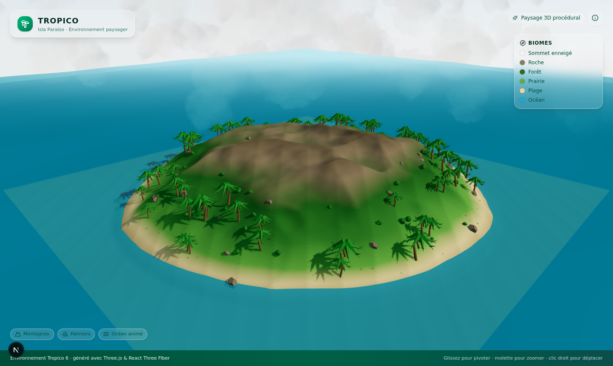

# 🌴 Tropico Island Landscape

Un environnement paysager 3D de style **Tropico 6** — une île tropicale procédurale avec terrain, océan animé, palmiers, montagnes enneigées et ciel ensoleillé. Construit avec **Next.js 16**, **Three.js** et **React Three Fiber**.



---

## ✨ Fonctionnalités

| Élément | Description |
|---------|-------------|
| 🏝️ **Terrain procédural** | Île générée par bruit de valeur (fBm) avec falloff radial — plage, prairie, forêt, roche, sommet enneigé |
| 🌊 **Océan animé** | Vagues en temps réel (déplacement de vertices), eau turquoise transparente sur fond bleu profond |
| 🌴 **~70 palmiers procéduraux** | Tronc courbé à 2 segments, 8 palmes retombantes, noix de coco, balancement au vent |
| 🪨 **Végétation dispersée** | Buissons, rochers, herbes de plage placés intelligemment sur les pentes valides |
| ☁️ **Nuages volumineux** | Cumulus en couches dérivant lentement au-dessus de l'île |
| ☀️ **Ciel atmosphérique** | Lumière directionnel (soleil) + hémisphérique, brouillard lointain, ombres dynamiques |
| 🎮 **Contrôles orbitaux** | Glisser / zoomer / déplacer pour explorer l'île sous tous les angles |
| 🖥️ **HUD style Tropico** | Titre « Isla Paraíso », légende des biomes rétractable, pastilles d'éléments, footer collant |
| 📱 **Responsive** | S'adapte au mobile (390×844) comme au desktop (1440×860) |

---

## 🛠️ Stack technique

- **[Next.js 16](https://nextjs.org/)** (App Router) + **TypeScript 5**
- **[Three.js](https://threejs.org/)** + **[@react-three/fiber](https://docs.pmnd.rs/react-three-fiber)** + **[@react-three/drei](https://github.com/pmndrs/drei)**
- **[Tailwind CSS 4](https://tailwindcss.com/)** + **[shadcn/ui](https://ui.shadcn.com/)** pour l'HUD
- **[Lucide](https://lucide.dev/)** pour les icônes

---

## 🚀 Installation & lancement

### Prérequis
- [Node.js](https://nodejs.org/) ≥ 20
- [Bun](https://bun.sh/) (recommandé) — ou npm/yarn/pnpm

### Étapes

```bash
# 1. Cloner le repo
git clone https://github.com/CMDX5/tropico-island-landscape.git
cd tropico-island-landscape

# 2. Installer les dépendances
bun install
# ou: npm install

# 3. Lancer le serveur de développement
bun run dev
# ou: npm run dev
```

---

## 👀 Comment voir le résultat

Le serveur démarre sur **http://localhost:3000**.

### 🖥️ Si tu es en local sur ta machine

Ouvre simplement **http://localhost:3000** dans ton navigateur après avoir lancé `bun run dev`.

### ☁️ Si tu es dans l'éditeur Z.ai Code (sandbox cloud)

> ⚠️ Les adresses `localhost` / `127.0.0.1` **ne sont pas accessibles** depuis l'extérieur de la sandbox.

Utilise plutôt le **Panneau de prévisualisation** situé à droite de l'interface :
1. Le serveur doit tourner (`bun run dev`)
2. La page s'affiche automatiquement dans le panneau de droite
3. Clique sur le bouton **« Ouvrir dans un nouvel onglet »** au-dessus du panneau pour la voir en grand

### 🎮 Contrôles dans la scène 3D

| Action | Effet |
|--------|-------|
| **Clic gauche + glisser** | Pivoter la caméra autour de l'île |
| **Molette** | Zoomer / dézoomer |
| **Clic droit + glisser** | Déplacer (pan) la caméra |
| **Bouton ℹ️ (haut droit)** | Afficher / masquer la légende des biomes |

---

## 📁 Structure du projet

```
src/
├── app/
│   ├── page.tsx              # Page principale : Canvas 3D + HUD overlay
│   ├── layout.tsx            # Layout racine
│   └── globals.css           # Styles Tailwind + thème
└── components/
    ├── tropico/
    │   ├── terrain.ts        # fBm noise, heightmap, coloration biomes, scatter()
    │   ├── IslandTerrain.tsx # Grille 220×220 avec hauteur + couleur par vertex
    │   ├── Ocean.tsx         # Surface animée par déplacement de vertices
    │   ├── PalmTree.tsx      # Palmier procédural (tronc courbé + palmes + vent)
    │   ├── Vegetation.tsx    # Dispersion palmiers / buissons / rochers / herbe
    │   ├── Clouds.tsx        # Nuages cumulus volumineux
    │   └── IslandScene.tsx   # Canvas R3F : lumières, ciel, contrôles orbite
    └── ui/                   # Composants shadcn/ui
```

---

## 🎨 Palette de biomes

La couleur du terrain évolue avec l'altitude, du sable mouillé jusqu'au sommet enneigé :

| Hauteur | Biome | Couleur |
|---------|-------|---------|
| < -1.4 | Sable mouillé | `#b89b6a` |
| -1.4 → 0.3 | Plage | `#ecd49a` |
| 0.3 → 1.8 | Sable → herbe | transition |
| 1.8 → 4.5 | Prairie | `#62ab44` |
| 4.5 → 7.5 | Prairie → forêt | `#3f8330` |
| 7.5 → 10.5 | Forêt | `#2d6a22` |
| 10.5 → 13.5 | Roche | `#8a7a63` |
| > 13.5 | Sommet enneigé | `#f2f2f2` |

---

## 🧠 Comment ça marche (aperçu technique)

### Génération du terrain
Le terrain est une grille 220×220 (~48 000 vertices). Pour chaque point `(x, z)` :
1. Un **falloff radial** fait descendre l'île sous l'eau en bordure
2. Un **bruit fBm** (5 octaves de value-noise) crée les collines
3. Un terme de **ridge** ajoute des crêtes montagneuses
4. La **couleur** est interpolée selon la hauteur calculée

Les normales sont calculées automatiquement par `computeVertexNormals()` pour un éclairage doux.

### Placement de la végétation
La fonction `scatter()` tire des positions aléatoires (seed déterministe) et n'accepte un arbre que si :
- l'altitude est dans la plage souhaitée (ex. palmiers : 0.5 → 6.5)
- la **pente** (delta de hauteur avec les voisins) reste sous un seuil
- la position n'entre pas dans une zone d'exclusion

Résultat : la végétation pousse naturellement sur les zones plates, jamais sur des falaises.

### Océan animé
Chaque frame, les vertices du plan d'eau sont déplacés selon une somme de sinus/cosinus à différentes fréquences → vagues roulantes. Les normales sont recalculées pour un reflet correct.

---

## 📜 Scripts disponibles

| Commande | Description |
|----------|-------------|
| `bun run dev` | Lance le serveur de développement (port 3000) |
| `bun run lint` | Vérifie le code avec ESLint |
| `bun run build` | Build de production |
| `bun run start` | Démarre le serveur de production |

---

## 📝 Licence

Projet de démonstration — libre d'utilisation et de modification.

---

<div align="center">

**🌴 Isla Paraíso · construit avec ❤️ et Three.js 🌴**

</div>
